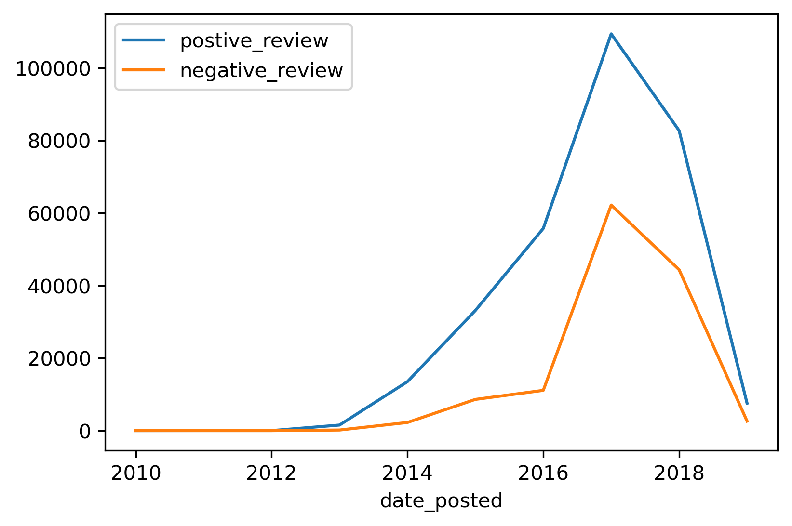
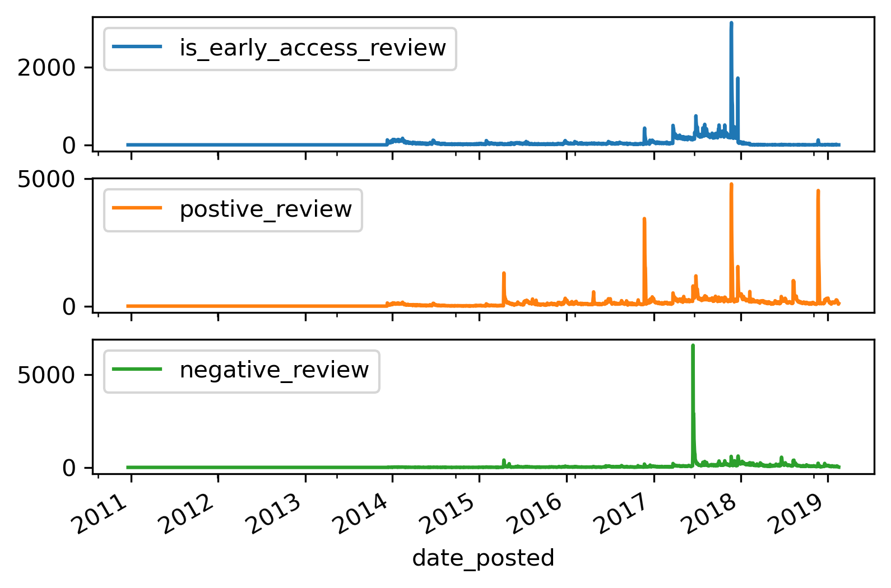
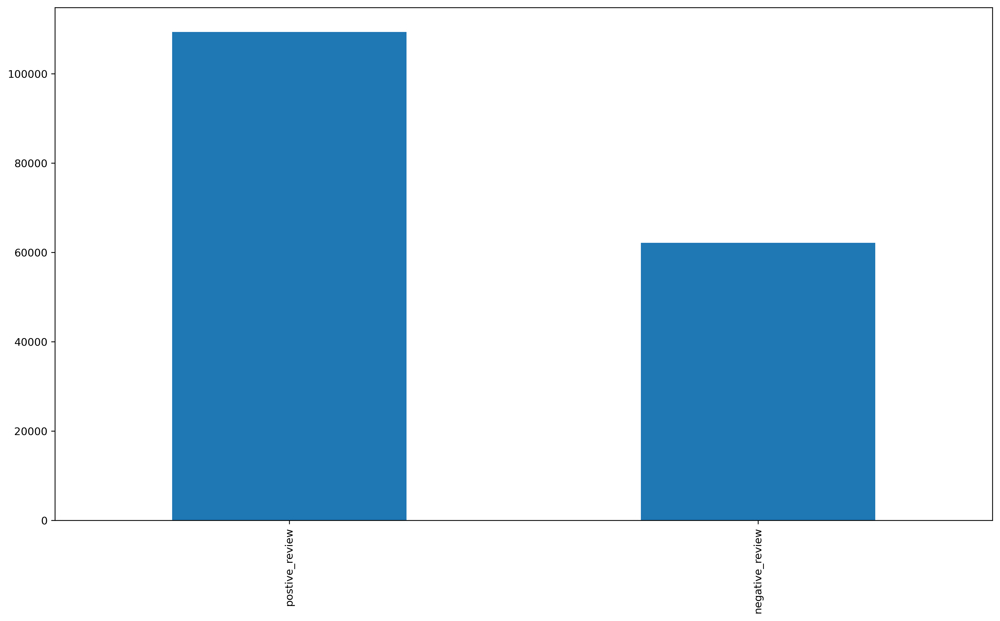
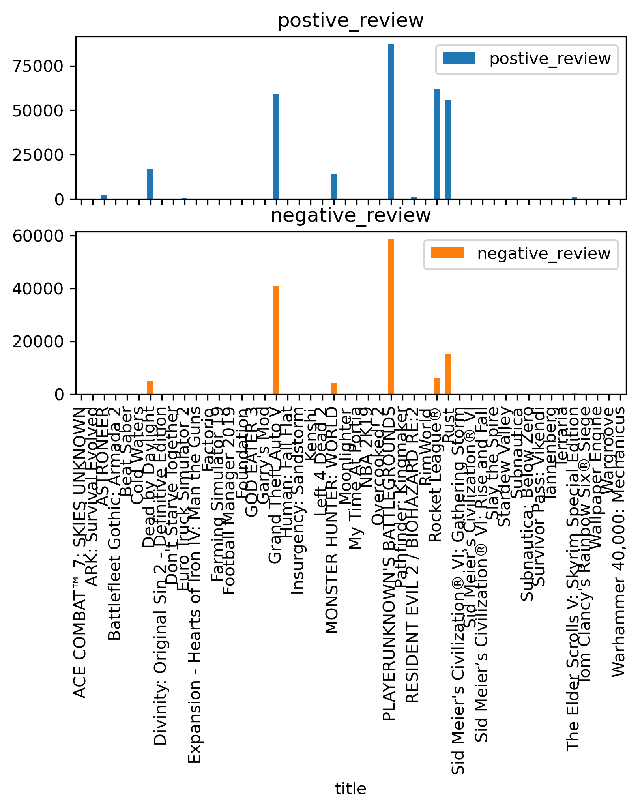
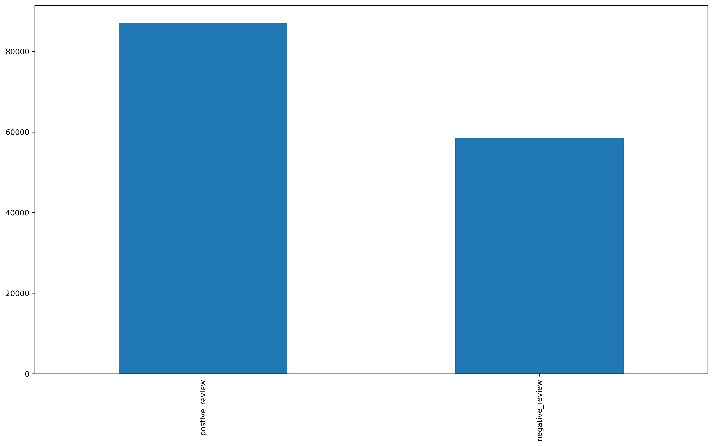

# Steam Reviews February 2010-December 2019

## Quick Background

### Steam Reviews

Steam is the biggest online marketplace for digital video games.  In 2013 the platform first allowed the general userbase. This quickly gained a reputation for being  generally useless due to the large amount of reviews and the volatility of online actors.

Most notable of these is what is know as a 'Review Bomb" in which a game is give a mass of negative reviews by both users and bots. These attacks are usually provoked by either a poorly received press statement by the publisher or one of the crew working on the game.

### Early Access

Introduced on March 20, 2013  Early Access (henceforth EA) was introduced as a way for developers to get active feedback along with more funding from their player as the game continues its development.

## Data

This first plot is showing the number of positive and negative reviews over the recorded period. An interesting thing to note is that there always is a higher number of positive reviews once the feature was added. 

***

This second plot goes over the number of views, positive and negative on the best selling games on Steam in the time frame that dataset recorded.

***
This is the graph of reviews of 2017 the year with the greatest number of reviews.

***
This plot shows the the reviews for each of the game for the data set.

The most important take away from this is that the game that engendered the most reviews and engagement was PLAYERUNKNOWN'S BATTLEGROUNDS (PuBG), a game that released in EA and as such is responsible for the large spike in EA reviews. PuBG first released on Steam in 2017 and has shown to drive some of the most engagement with the service compared to everything other than Grand Theft Auto V

***

## Conclusion

This analysis of the dataset shows a surprising detail.  Even if Steam Reviews have a bad reputation for toxicity, the number of positive reviews greatly outpaces the negative.